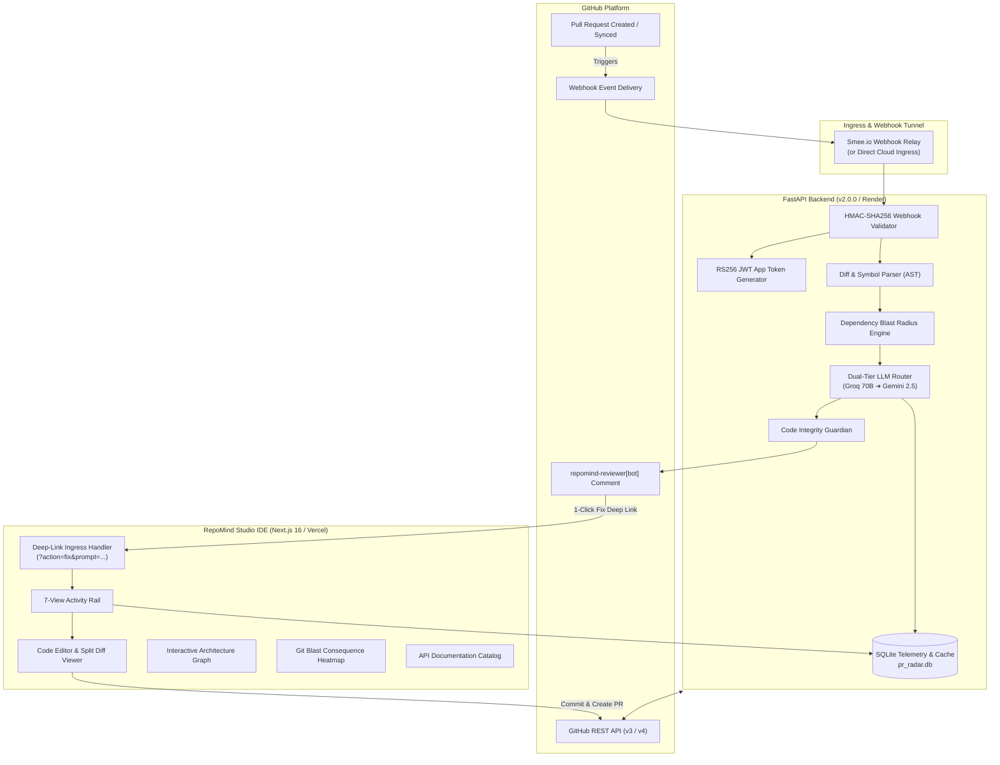
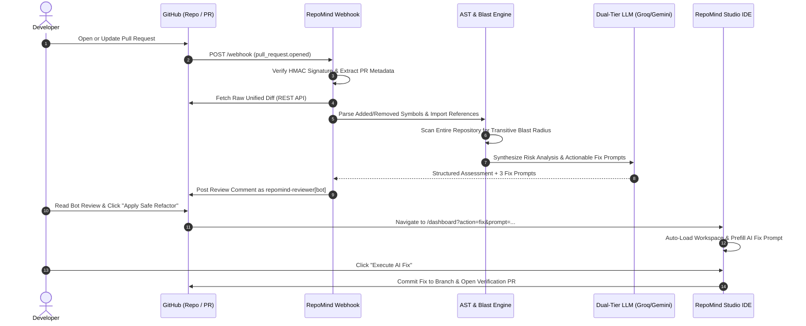

<div align="center">

# RepoMind

### Autonomous AI Code Review & AST Blast Radius Engine
**Release 2.0 (v2.0.0)**

[](https://github.com/PG300604/REPOMIND-IBM_BOB2.0_HACKATHON_PROJ/releases)
[](https://github.com/apps/repomind-reviewer)
[](LICENSE)
[](https://github.com/apps/repomind-reviewer)
[](https://python.org)
[](https://fastapi.tiangolo.com)
[](https://nextjs.org)
[](https://react.dev)
[](https://render.com)
[](https://vercel.com)

**An enterprise-grade, autonomous AI Pull Request engineering platform that parses AST symbol diffs, computes multi-hop dependency blast radii, performs pre-commit code integrity checks, and executes automated PR reviews via an official GitHub App (`repomind-reviewer[bot]`) — seamlessly paired with an Obsidian-themed Studio IDE for 1-click remediation.**

[Live Demo](https://repomind-ibm-bob-2-0-hackathon-proj.vercel.app) · [Install GitHub App](https://github.com/apps/repomind-reviewer) · [Live Review Showcase (PR #6)](https://github.com/PG300604/REPOMIND-IBM_BOB2.0_HACKATHON_PROJ/pull/6) · [Report Issue](https://github.com/PG300604/REPOMIND-IBM_BOB2.0_HACKATHON_PROJ/issues)

</div>

---

## Table of Contents

- [Overview & What Sets RepoMind Apart](#overview--what-sets-repomind-apart)
- [Key Features](#key-features)
- [System Architecture](#system-architecture)
- [Autonomous GitHub App Bot (`repomind-reviewer[bot]`)](#autonomous-github-app-bot-repomind-reviewerbot)
- [1-Click AI Fix Deep-Linking Engine](#1-click-ai-fix-deep-linking-engine)
- [Code Integrity Guardian & AST Blast Engine](#code-integrity-guardian--ast-blast-engine)
- [Studio IDE Views (Activity Rail)](#studio-ide-views-activity-rail)
- [Tech Stack](#tech-stack)
- [Project Structure](#project-structure)
- [API Reference](#api-reference)
- [Getting Started & Local Setup](#getting-started--local-setup)
- [GitHub App Registration & Webhook Setup](#github-app-registration--webhook-setup)
- [Deployment](#deployment)
- [Keep-Alive Daemon](#keep-alive-daemon)
- [License](#license)

---

## Overview & What Sets RepoMind Apart

Standard PR tools evaluate code by scanning only the lines modified inside the diff, completely blind to downstream side-effects. **RepoMind** takes an entirely different architectural paradigm:

1. **AST-Driven Blast Radius Tracing**: When a function signature, class interface, or type definition is modified, RepoMind's Abstract Syntax Tree (AST) engine traces downstream callers, import paths, and cross-module consumers across the entire repository to uncover hidden breaking changes before they reach staging.
2. **Dual-Tier Resilient AI Inference**: Zero-downtime intelligence pipeline. Ultra-fast Groq LLaMA-3.3 70B Versatile serves as the primary inference engine (~250 tokens/sec), with automatic, silent fallback to Google Gemini 2.5 Flash / Flash Lite in the event of rate limits or provider throttling.
3. **Autonomous GitHub App Integration (`repomind-reviewer[bot]`)**: Runs as a verified GitHub App. When a PR is opened or synchronized, RepoMind validates the HMAC-SHA256 signature, parses the diff, computes risk metrics, generates 3 actionable fix prompts, and posts a formatted review directly on GitHub authenticated by an RS256 JWT installation token.
4. **1-Click AI Fix Deep-Linking**: Review comments on GitHub contain direct deep links (`/dashboard?repo=...&pr=...&action=fix&prompt=...`) back into the RepoMind Studio IDE. Clicking an action button loads the repository, activates the affected file, prefills the AI instruction, and opens the split diff viewer for immediate one-click patching and PR submission.
5. **Code Integrity Guardian**: Rejects truncated code, stubbed comments (such as `// ... existing code ...`), syntax errors, or hallucinated APIs prior to saving or pushing to GitHub branches.
6. **Obsidian Studio IDE**: A full-featured, VS Code-inspired browser IDE featuring 7 specialized workspace views: Tabbed Editor, Git Blast Heatmap, Interactive Architecture Graph, API Documentation Catalog, Real-Time Webhook Monitor, SQLite Telemetry Dashboard, and Model/Tool Configuration.

---

## Key Features

| Capability | Technical Implementation |
|---|---|
| **Autonomous PR Review Bot** | GitHub App (`repomind-reviewer[bot]`) triggered via webhook; authenticates using private key RS256 JWT and installation tokens. |
| **AST Blast Radius Engine** | Multi-file regex & AST parsing engine identifying direct and transitive consumers of modified symbols. |
| **1-Click Remediation** | GitHub review comments include deep links that launch the RepoMind IDE with pre-loaded AI prompts for safe refactors, test synthesis, and patch generation. |
| **Resilient Dual LLM Pipeline** | Primary: Groq LLaMA-3.3 70B Versatile. Secondary Fallback: Google Gemini 2.5 Flash. Fully transparent error recovery. |
| **Code Integrity Guardian** | Pre-commit AST validation prevents code truncation, half-formed edits, hallucinated placeholders, and syntax breakages. |
| **Interactive Architecture Graph** | SVG-rendered interactive topological map visualizing dependency clusters, hotspots, and component connections. |
| **SQLite Telemetry & Vacuum** | In-database metrics tracking analyses, OAuth sessions, app installations, and API response latencies with 1-click vacuuming. |
| **Full Security & Quality Audit** | Background scanner evaluating security flaws, vulnerability vectors, UI regressions, and code smells across all repo files. |
| **Direct GitHub PR Creation** | Branches, commits, and opens pull requests directly through GitHub REST API without requiring local git clones. |
| **Obsidian Dark UI** | CSS Grid responsive IDE with amber accent system, command palette (`Ctrl+K`), custom tabs, and status telemetry. |

---

## System Architecture

### High-Level Architecture


```mermaid
flowchart TB
    subgraph GitHub["GitHub Platform"]
        PR["Pull Request Created / Synced"]
        WH_S["Webhook Event Delivery"]
        BOT["repomind-reviewer[bot] Comment"]
        REST["GitHub REST API (v3 / v4)"]
    end

    subgraph Ingress["Ingress & Webhook Tunnel"]
        SMEE["Smee.io Webhook Relay\n(or Direct Cloud Ingress)"]
    end

    subgraph Backend["FastAPI Backend (v2.0.0 / Render)"]
        AUTH["HMAC-SHA256 Webhook Validator"]
        JWT["RS256 JWT App Token Generator"]
        DP["Diff & Symbol Parser (AST)"]
        DF["Dependency Blast Radius Engine"]
        GUARD["Code Integrity Guardian"]
        LLM["Dual-Tier LLM Router\n(Groq 70B ➔ Gemini 2.5)"]
        DB[(SQLite Telemetry & Cache\npr_radar.db)]
    end

    subgraph Frontend["RepoMind Studio IDE (Next.js 16 / Vercel)"]
        DEEP["Deep-Link Ingress Handler\n(?action=fix&prompt=...)"]
        IDE["7-View Activity Rail"]
        DIFF["Code Editor & Split Diff Viewer"]
        GRAPH["Interactive Architecture Graph"]
        BLAST["Git Blast Consequence Heatmap"]
        CATALOG["API Documentation Catalog"]
    end

    PR -->|Triggers| WH_S
    WH_S --> SMEE --> AUTH
    AUTH --> JWT
    AUTH --> DP --> DF --> LLM --> GUARD
    GUARD --> BOT
    BOT -->|1-Click Fix Deep Link| DEEP
    DEEP --> IDE --> DIFF
    DIFF -->|Commit & Create PR| REST
    LLM --> DB
    IDE --> DB
    REST <--> Backend
```

### Autonomous Review & 1-Click Fix Sequence


```mermaid
sequenceDiagram
    autonumber
    actor Dev as Developer
    participant GH as GitHub (Repo / PR)
    participant WH as RepoMind Webhook
    participant AST as AST & Blast Engine
    participant AI as Dual-Tier LLM (Groq/Gemini)
    participant IDE as RepoMind Studio IDE

    Dev->>GH: Open or Update Pull Request
    GH->>WH: POST /webhook (pull_request.opened)
    WH->>WH: Verify HMAC Signature & Extract PR Metadata
    WH->>GH: Fetch Raw Unified Diff (REST API)
    WH->>AST: Parse Added/Removed Symbols & Import References
    AST->>AST: Scan Entire Repository for Transitive Blast Radius
    AST->>AI: Synthesize Risk Analysis & Actionable Fix Prompts
    AI-->>WH: Structured Assessment + 3 Fix Prompts
    WH->>GH: Post Review Comment as repomind-reviewer[bot]
    Dev->>GH: Read Bot Review & Click "Apply Safe Refactor"
    GH->>IDE: Navigate to /dashboard?action=fix&prompt=...
    IDE->>IDE: Auto-Load Workspace & Prefill AI Fix Prompt
    Dev->>IDE: Click "Execute AI Fix"
    IDE->>GH: Commit Fix to Branch & Open Verification PR
```

---

## Autonomous GitHub App Bot (`repomind-reviewer[bot]`)

RepoMind is configured as an official GitHub App (`app_id: 5094021`, App Name: `RepoMind-Reviewer`).

When installed on any repository, RepoMind automatically reviews incoming pull requests with zero manual configuration.

### Live Production Verification
- **Verified Pull Request**: [#6 on PG300604/REPOMIND-IBM_BOB2.0_HACKATHON_PROJ](https://github.com/PG300604/REPOMIND-IBM_BOB2.0_HACKATHON_PROJ/pull/6)
- **Bot Review Comment**: [Comment #5854011256](https://github.com/PG300604/REPOMIND-IBM_BOB2.0_HACKATHON_PROJ/pull/6#issuecomment-5854011256)
- **Actor Identity**: `repomind-reviewer[bot]` with official application icon.

### Review Comment Anatomy
Every review posted by RepoMind contains:
1. **Header Banner**: Official RepoMind visual branding and execution timestamp.
2. **Risk Assessment Metric**: Computed severity rating (Low / Medium / High) with justification.
3. **AST Symbol Breakdown**: Identified functions, classes, and types directly modified in the diff.
4. **Blast Radius Analysis**: Downstream files and modules that depend on the changed symbols.
5. **Missing Test Coverage**: Explicit test scenarios required to prevent regressions.
6. **1-Click AI Fix Actions**: Pre-formatted action links that open the RepoMind IDE studio with pre-loaded instructions.

---

## 1-Click AI Fix Deep-Linking Engine

The bridge between GitHub and RepoMind is the deep-linking ingress engine:

```
http://localhost:3000/dashboard?repo={owner}/{repo}&pr={number}&action=fix&prompt={encoded_ai_instruction}
```

When a reviewer or author clicks a fix button on GitHub:
1. The RepoMind Studio IDE loads the target repository and checks out the PR branch.
2. The affected file is automatically opened in the tabbed editor.
3. The prompt is injected directly into the AI Review & Remediation panel.
4. The user clicks **Apply Fix** to inspect an inline side-by-side unified diff and push the commit directly back to GitHub.

### Standard Fix Actions Provided:
- `Apply Safe Refactor`: Hardens error handling, type definitions, and edge cases.
- `Synthesize Test Suite`: Generates targeted unit tests matching the exact blast radius.
- `Code Integrity Patch`: Eliminates truncated segments, stubbed comments, and syntax risks.

---

## Code Integrity Guardian & AST Blast Engine

### AST Symbol Extraction & Downstream Scanning
```python
# Extracts symbols from diff additions/deletions:
# Functions: def my_func(...) | function myFunc(...)
# Classes: class MyClass(...) | interface MyInterface
# Imports: import { x } from '...' | from x import y
```
Once symbols are parsed, `dependency_finder.py` traverses all repository files to construct a dependency graph, determining the exact downstream "blast radius".

### Anti-Truncation & Code Integrity Rules
AI-generated code fixes pass through strict pre-commit verification before they are presented to the user or committed to GitHub:
- **No Incomplete Markers**: Reject any code containing `...`, `// rest of code`, `/* existing code */`, or `# TODO: implement`.
- **AST Validability**: Python code is parsed with `ast.parse()`; JavaScript/TypeScript is verified for matched braces and clean block scope.
- **Completeness Guarantee**: Code must be a 100% complete, drop-in replacement file.

---

## Studio IDE Views (Activity Rail)

RepoMind's UI is laid out in a responsive CSS Grid with 7 specialized views accessible via the left activity rail:

| View | Activity Key | Description |
|---|---|---|
| **Code Editor** | `code` | Obsidian dark tabbed editor with syntax highlighting, line numbers, AI fix generator, and GitHub PR creator. |
| **Git Blast Radius** | `git` | Visual consequence matrix showing staged diff symbols, downstream consumers, and risk level indicators. |
| **Architecture Graph** | `flow` | Interactive SVG node diagram mapping repository directories, modules, and cross-file dependencies. |
| **API Catalog** | `catalog` | AI-generated API reference documentation, endpoint schemas, request/response payloads, and changelog. |
| **Webhook Sync** | `cloud` | Real-time GitHub webhook sync monitor, delivery payload inspector, and autonomous review simulator. |
| **Database & Telemetry** | `db` | SQLite telemetry dashboard displaying cached analyses, OAuth sessions, app installations, and DB vacuum utility. |
| **Tools & Configuration** | `tools` | Studio configuration, active LLM model routing (Groq / Gemini), API keys, and keyboard shortcut cheatsheet. |

---

## Tech Stack

| Component | Technology | Version | Purpose |
|---|---|---|---|
| **Frontend Framework** | Next.js (App Router, Turbopack) | 16.3.6 | Server and client rendering |
| **UI Library** | React | 19.2.8 | Declarative reactive UI |
| **Styling** | Tailwind CSS + Obsidian Theme | 4.x | Dark-mode developer IDE styling |
| **Icons & Primitives** | Radix UI + Lucide React | Latest | Accessible accessible UI components |
| **Backend Framework** | FastAPI | 2.0.0 | High-performance Python async REST API |
| **Runtime** | Python | 3.12+ | AST parsing and backend logic |
| **Primary AI Engine** | Groq (llama-3.3-70b-versatile) | Latest | Fast inference for risk analysis & fixes |
| **Fallback AI Engine** | Google Gemini (gemini-2.5-flash) | Latest | High-availability fallback intelligence |
| **Database** | SQLite via SQLAlchemy | 2.0+ | Persistent telemetry, cache & session store |
| **GitHub Auth** | RS256 JWT + GitHub App API | — | Autonomous bot comments as `repomind-reviewer[bot]` |
| **OAuth** | GitHub OAuth 2.0 | — | Secure user authentication |
| **Backend Host** | Render | Cloud | FastAPI production hosting |
| **Frontend Host** | Vercel | Cloud | Global edge frontend deployment |

---

## Project Structure

```
RepoMind/
├── backend/
│   ├── __init__.py
│   ├── main.py                     # FastAPI application v2.0.0, CORS, all REST endpoints
│   ├── github_app.py               # GitHub App RS256 JWT auth & installation token comment posting
│   ├── diff_parser.py              # Unified diff parser & AST symbol extractor
│   ├── dependency_finder.py        # AST blast radius — repo-wide symbol scanner
│   ├── llm_client.py               # Groq LLaMA-3.3-70B + Gemini 2.5 dual-tier fallback engine
│   ├── database.py                 # SQLite database models, migrations & telemetry queries
│   ├── github_client.py            # GitHub REST API client (files, branches, PRs, commits)
│   ├── oauth.py                    # GitHub OAuth 2.0 authentication & session cookies
│   ├── webhook.py                  # GitHub App webhook intake (pull_request, ping, installation)
│   └── models.py                   # Pydantic data schemas
│
├── frontend/
│   ├── app/
│   │   ├── layout.tsx              # Root layout with metadata & fonts
│   │   ├── page.tsx                # Animated landing page with MoltenMetal WebGL hero
│   │   ├── dashboard/
│   │   │   └── page.tsx            # Full VS Code-style IDE studio with deep-link query parser
│   │   ├── icon.svg                # RepoMind brand mark favicon
│   │   └── favicon.ico             # Brand favicon
│   ├── components/
│   │   ├── Shell.tsx               # CSS Grid 4-pane IDE layout engine
│   │   ├── FileTree.tsx            # Repository file explorer, branch picker & PR history
│   │   ├── DiffViewer.tsx          # Code editor with split diff preview & AI fix prompt panel
│   │   ├── ReviewPanel.tsx         # AI risk analysis panel & full-repo security scanner
│   │   ├── AnalyzeModal.tsx        # Manual PR analysis modal (URL or raw diff)
│   │   ├── WorkspaceLauncher.tsx   # Workspace switcher & repo selector
│   │   ├── StatusBar.tsx           # Telemetry status bar (risk indicator, auth state)
│   │   ├── MoltenMetal.tsx         # WebGL animated canvas on landing page
│   │   ├── LogoLoop.tsx            # Animated tech stack ticker
│   │   └── views/
│   │       ├── GitBlastView.tsx            # Consequence matrix & blast radius heatmap
│   │       ├── ArchitectureGraphView.tsx   # Interactive SVG architecture topology graph
│   │       ├── CatalogView.tsx             # AI-generated API schemas & documentation
│   │       ├── WebhookSyncView.tsx         # Real-time webhook events & review simulation
│   │       ├── DatabaseView.tsx            # SQLite telemetry tables & DB vacuum utility
│   │       └── ToolsConfigView.tsx         # Model configuration, routing & shortcuts
│   ├── lib/
│   │   ├── api.ts                  # Fully typed TypeScript API client
│   │   └── utils.ts                # Styling & string utilities
│   ├── next.config.ts              # Next.js configuration & API rewrites
│   ├── package.json                # Frontend dependencies (v2.0.0)
│   └── tsconfig.json               # TypeScript configuration
│
├── data/
│   ├── pr_radar.db                 # SQLite database (auto-created)
│   └── repomind_logo.png           # 500x500 official RepoMind branding asset
│
├── scripts/
│   └── keep_alive_ping.py          # Standalone keep-alive daemon for cloud hosting
│
├── .github/
│   └── workflows/
│       └── keep_alive.yml          # GitHub Actions keep-alive cron
│
├── requirements.txt                # Pinned Python backend dependencies
├── render.yaml                     # Render cloud deployment blueprint
├── LICENSE                         # MIT License
└── README.md                       # Comprehensive documentation
```

---

## API Reference

### Core Analysis & Risk
| Method | Endpoint | Description |
|---|---|---|
| `GET` | `/health` | Service health status and version (`v2.0.0`) |
| `POST` | `/analyze` | Analyze a PR by URL, repository + PR number, or raw diff |
| `GET` | `/analysis/{repo}/{pr_number}` | Fetch cached analysis from SQLite |
| `GET` | `/analyses?limit=20` | List recent PR analyses for workspace history |

### Telemetry & System
| Method | Endpoint | Description |
|---|---|---|
| `GET` | `/telemetry/stats` | Aggregated system metrics (total analyses, high risk count, DB size) |
| `GET` | `/telemetry/oauth-sessions` | Active authenticated sessions |
| `GET` | `/telemetry/installations` | Registered GitHub App installations |
| `GET` | `/telemetry/manuals` | AI-generated API documentation records |
| `POST` | `/telemetry/vacuum` | Execute SQLite `VACUUM` to optimize database storage |

### Repository & Workspace
| Method | Endpoint | Description |
|---|---|---|
| `GET` | `/repo/workspace?repo=...` | Fetch file tree, branches, PRs, and issues |
| `GET` | `/workspaces` | List active workspace sessions |
| `DELETE` | `/workspaces/{repo}` | Remove a workspace session |
| `GET` | `/repo/pulls?repo=...` | Real-time pull requests synced directly from GitHub |
| `GET` | `/repo/file-content?repo=...&path=...` | Read file content from GitHub or disk |
| `POST` | `/repo/file-content` | Save file content locally or stage for commit |

### AI Generation & Remediation
| Method | Endpoint | Description |
|---|---|---|
| `POST` | `/repo/full-scan` | Complete repository security, quality, and bug audit |
| `POST` | `/repo/generate-docs` | Generate interactive API documentation from source code |
| `POST` | `/ai/generate-code` | Generate complete code replacement from natural language |
| `POST` | `/repo/create-pr` | Create branch, commit modified code, and open PR on GitHub |

### GitHub App & Webhooks
| Method | Endpoint | Description |
|---|---|---|
| `POST` | `/webhook` | Ingest GitHub webhook events (`pull_request`, `ping`, `installation`) |
| `POST` | `/github-app/simulate-review` | Trigger autonomous review simulation for testing |
| `GET` | `/auth/github` | Initiate GitHub OAuth login flow |
| `GET` | `/auth/callback` | OAuth redirect callback (sets session cookie) |
| `GET` | `/auth/me` | Fetch currently authenticated GitHub user profile |
| `GET` | `/auth/logout` | Terminate session and clear cookies |

---

## Getting Started & Local Setup

### Prerequisites
- **Python 3.12+**
- **Node.js 18+** with npm
- **Groq API Key** ([console.groq.com](https://console.groq.com) — free tier)
- **Google Gemini API Key** ([aistudio.google.com](https://aistudio.google.com) — free tier fallback)
- **GitHub Personal Access Token (PAT)** with `repo` scope

### 1. Clone & Setup Backend
```bash
git clone https://github.com/PG300604/REPOMIND-IBM_BOB2.0_HACKATHON_PROJ.git
cd REPOMIND-IBM_BOB2.0_HACKATHON_PROJ

# Setup Python virtual environment
python -m venv .venv
.venv\Scripts\activate           # Windows
# source .venv/bin/activate      # macOS/Linux

# Install dependencies
pip install -r requirements.txt
```

### 2. Configure Environment Variables
Create `.env` in the repository root:
```env
# Required
GITHUB_TOKEN=ghp_your_github_token
GROQ_API_KEY=gsk_your_groq_api_key
SECRET_KEY=repomind-secret-key-32chars

# AI Fallback (Recommended)
GEMINI_API_KEY=your_gemini_api_key

# GitHub App Integration (Optional for local testing, required for bot reviews)
GITHUB_APP_ID=5094021
GITHUB_WEBHOOK_SECRET=your_webhook_secret

# CORS
CORS_ALLOWED_ORIGINS=http://localhost:3000
```

> **Note on GitHub App Private Key**: Place your downloaded `github_app.pem` directly into `data/github_app.pem`. RepoMind automatically reads the file without needing manual newline escaping.

### 3. Setup Frontend
```bash
cd frontend
npm install
cd ..
```

### 4. Launch Development Servers
Open two terminals:

**Terminal 1 — FastAPI Backend:**
```bash
uvicorn backend.main:app --host 0.0.0.0 --port 8000 --reload
```

**Terminal 2 — Next.js Studio IDE:**
```bash
cd frontend
npm run dev
```

Visit **`http://localhost:3000`** in your browser.

---

## GitHub App Registration & Webhook Setup

To deploy your own instance of the RepoMind Reviewer bot:

1. In GitHub, navigate to **Settings** ➔ **Developer settings** ➔ **GitHub Apps** ➔ **New GitHub App**.
2. **App Name**: `RepoMind-Reviewer`
3. **Homepage URL**: `https://repomind-ibm-bob-2-0-hackathon-proj.vercel.app`
4. **Webhook URL**: Your backend URL + `/webhook` (e.g., via [Smee.io](https://smee.io) for local development).
5. **Permissions**:
   - `Pull requests`: Read & Write
   - `Issues`: Read & Write
   - `Contents`: Read-only
   - `Metadata`: Read-only
6. **Subscribe to Events**: Check `Pull request`.
7. Generate a **Private Key** and save it as `data/github_app.pem`.
8. Install the app on your target repository.

For local webhook forwarding:
```bash
npx smee-client --url https://smee.io/your-channel --target http://localhost:8000/webhook
```

---

## Deployment

### Backend on Render
1. Create a **Web Service** on [Render](https://render.com).
2. Connect your GitHub repository.
3. Configure the build and start commands:
   - **Build Command**: `pip install -r requirements.txt`
   - **Start Command**: `uvicorn backend.main:app --host 0.0.0.0 --port $PORT`
4. Set environment variables: `GITHUB_TOKEN`, `GROQ_API_KEY`, `GEMINI_API_KEY`, `GITHUB_APP_ID`, `GITHUB_WEBHOOK_SECRET`, `SECRET_KEY`.

### Frontend on Vercel
1. Import the repository on [Vercel](https://vercel.com).
2. Set **Root Directory** to `frontend`.
3. Set environment variable: `BACKEND_URL=https://your-backend.onrender.com`.
4. Deploy.

---

## Keep-Alive Daemon

To prevent free-tier cloud containers from sleeping after periods of inactivity, RepoMind includes an automated keep-alive routine:
- **GitHub Actions Cron**: [`.github/workflows/keep_alive.yml`](.github/workflows/keep_alive.yml) runs every 10 minutes to ping `/health`.
- **Standalone Python Script**:
```bash
python scripts/keep_alive_ping.py https://your-backend.onrender.com 10
```

---

## License

Distributed under the **MIT License**. See [`LICENSE`](LICENSE) for complete details.

---

<div align="center">

**Built for the IBM BOB 2.0 Hackathon 2026**

Crafted with precision by [PG300604](https://github.com/PG300604)

</div>
