# RepoMind 2.0 — Hackathon Submission & Visual Proof Showcase
**IBM BOB 2.0 Hackathon 2026**

---

## Executive Summary

**RepoMind** is an enterprise-grade autonomous AI code review platform and AST blast radius engine. Unlike conventional static linters and simple diff summarizers that only inspect lines inside a patch, RepoMind constructs an Abstract Syntax Tree (AST) symbol graph across the entire repository to uncover direct and transitive downstream breaking changes before code reaches staging.

Operating as an official GitHub App (`repomind-reviewer[bot]`), RepoMind automatically reviews pull requests via webhook events, computes risk indices, synthesizes targeted regression test scenarios, and provides **1-click deep-linked remediation actions** that open directly into an Obsidian-themed Studio IDE for inline diff inspection and automated commit.

---

## Key Live Links & Deliverables

| Deliverable | Live Production URL |
|---|---|
| **Live Studio IDE** | [https://repomind-ibm-bob-2-0-hackathon-proj.vercel.app](https://repomind-ibm-bob-2-0-hackathon-proj.vercel.app) |
| **GitHub Repository** | [https://github.com/PG300604/REPOMIND-IBM_BOB2.0_HACKATHON_PROJ](https://github.com/PG300604/REPOMIND-IBM_BOB2.0_HACKATHON_PROJ) |
| **Official GitHub Release 2.0 (v2.0.0)** | [https://github.com/PG300604/REPOMIND-IBM_BOB2.0_HACKATHON_PROJ/releases/tag/v2.0.0](https://github.com/PG300604/REPOMIND-IBM_BOB2.0_HACKATHON_PROJ/releases/tag/v2.0.0) |
| **Live Autonomous Bot Review (PR #6)** | [https://github.com/PG300604/REPOMIND-IBM_BOB2.0_HACKATHON_PROJ/pull/6#issuecomment-5854011256](https://github.com/PG300604/REPOMIND-IBM_BOB2.0_HACKATHON_PROJ/pull/6#issuecomment-5854011256) |
| **Official GitHub App Listing** | [https://github.com/apps/repomind-reviewer](https://github.com/apps/repomind-reviewer) |

---

## Visual Proof & Demonstration Gallery

All 16 high-resolution screenshots below are captured from live production and local runtime environments and stored under `docs/screenshots/`.

---

### Category 1: Real-World GitHub Integration & Autonomous Bot Review

#### 01. Official Installed GitHub App (`RepoMind-Reviewer`)
The official GitHub App is verified and installed under user applications, granting direct installation token authority to comment as `repomind-reviewer[bot]`.
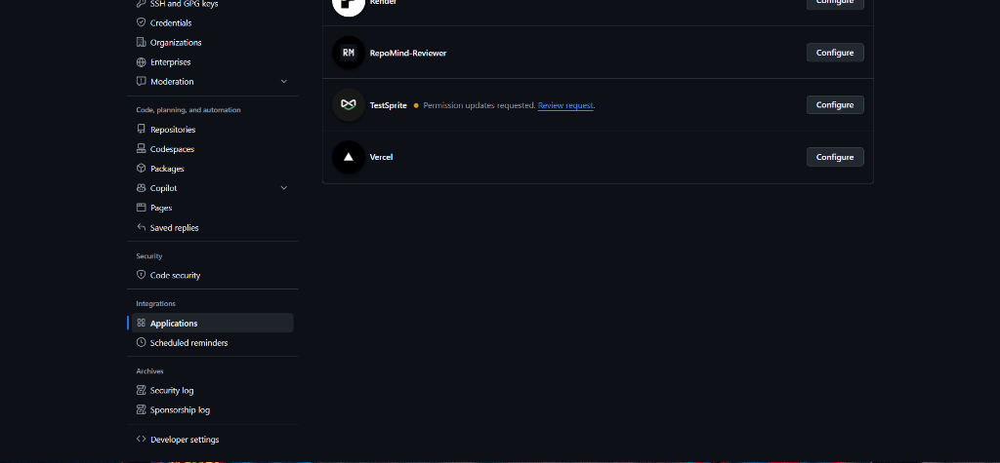

#### 02. Pull Request Webhook Ingress (PR #6)
Live pull request lifecycle showing PR #6 merged, branch commits, CI checks, Vercel preview deployment, and autonomous intake by the RepoMind webhook pipeline.
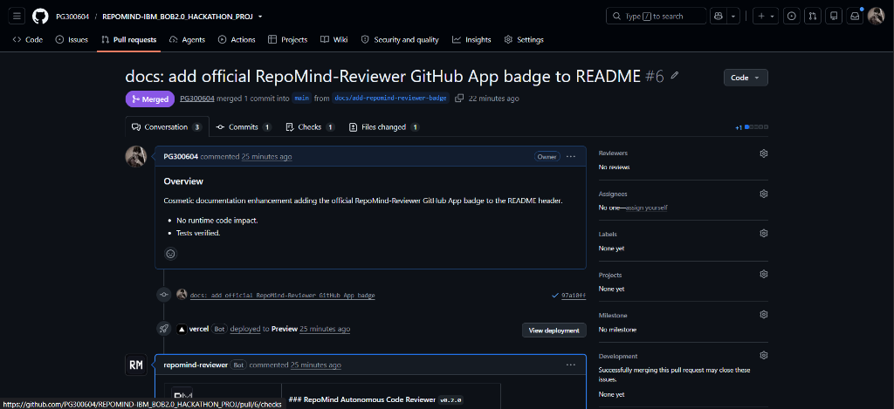

#### 03. Autonomous Review & Risk Radar Comment
The formatted review comment posted directly on GitHub by `repomind-reviewer[bot]`, displaying the computed `LOW RISK` rating, Summary & Walkthrough, AST Modified Symbols, Downstream Blast Radius scan, and 3 Synthesized Test Cases.
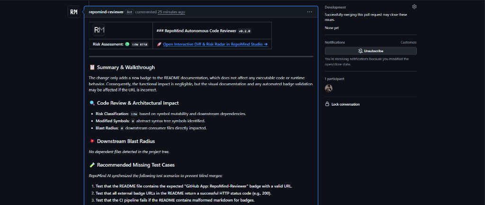

#### 04. Actionable 1-Click AI Fix Prompts with Deep Links
The bottom section of the bot review comment providing 3 actionable remediation prompts (*Safe AST Refactor*, *Synthesize Tests*, *Anti-Truncation Patch*) with direct deep links (`/dashboard?repo=...&pr=...&action=fix&prompt=...`) back into the Studio IDE.
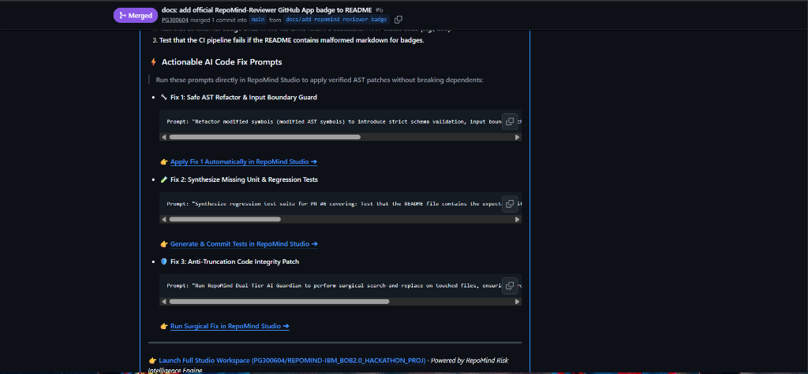

#### 05. Official GitHub Release 2.0 (v2.0.0)
The published Release 2.0 on GitHub, including release notes, git tag `v2.0.0`, commit hash `93371b7`, and architectural highlights.
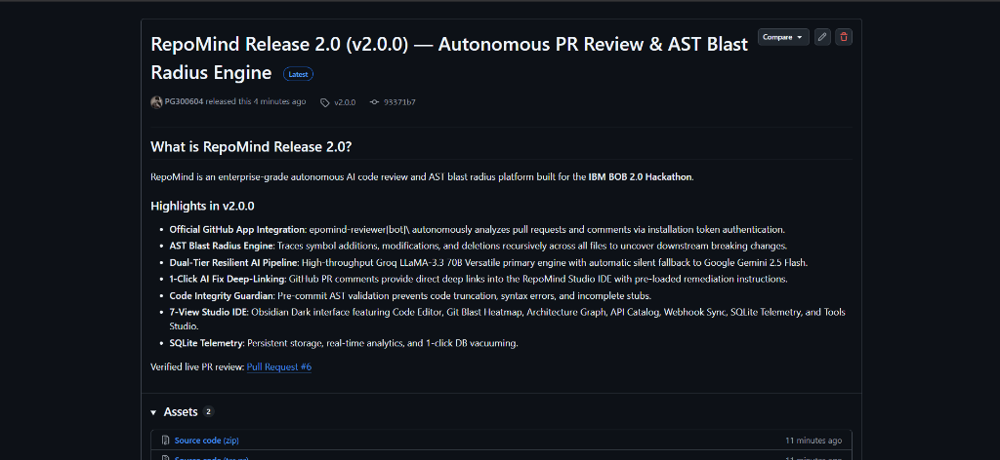

---

### Category 2: Studio IDE Onboarding & Workspace Session Management

#### 06. Obsidian Dark Hero Landing Page
Landing page with WebGL canvas ("Where Code Meets Intelligent Risk Radar"), value proposition, live status indicator, and tech stack ticker.
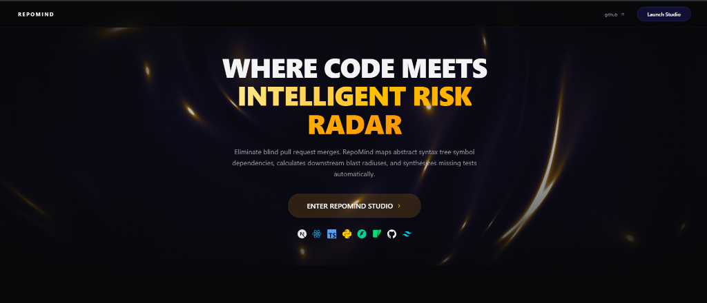

#### 07. Initialize Repository Session & Workspace Launcher
Workspace session selector supporting URL shorthand, 1-click preset repositories (IBM BOB 2.0 Hackathon Project), and indexed workspace sessions with 1,641 files and 6 PRs.
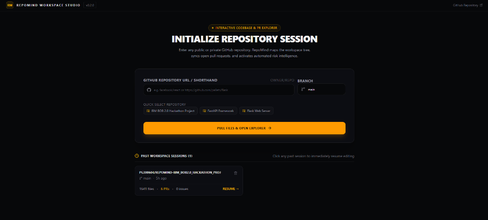

---

### Category 3: Visual AST Intelligence & Dependency Tracing

#### 08. Interactive Architecture Node Graph
Topological SVG map depicting frontend components, API gateways, AST blast engine, and SQLite persistence engine communication paths.
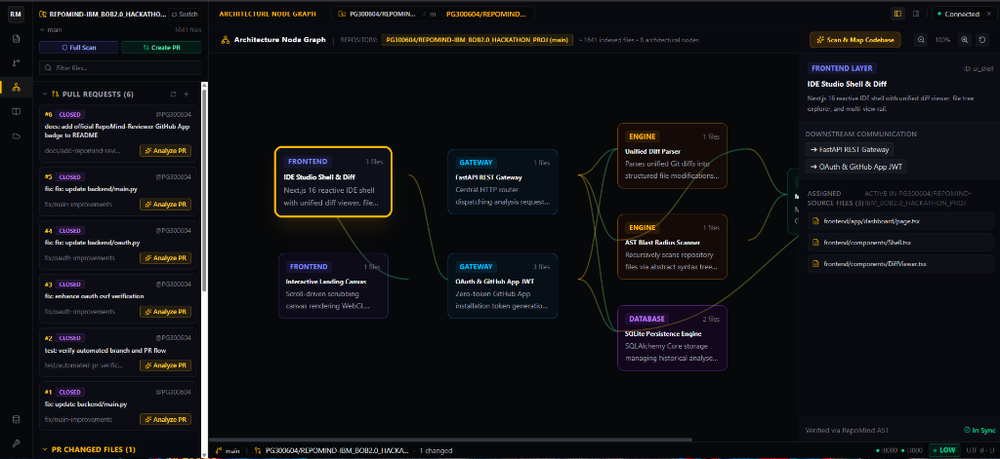

#### 09. AST Blast Radius & Domino Effect Simulator
Consequence matrix tracing modified symbols from **Ground Zero (Origin Code)** through **Direct Callers** and **2nd-Hop Transitive Ripples** to verify end-system impact.
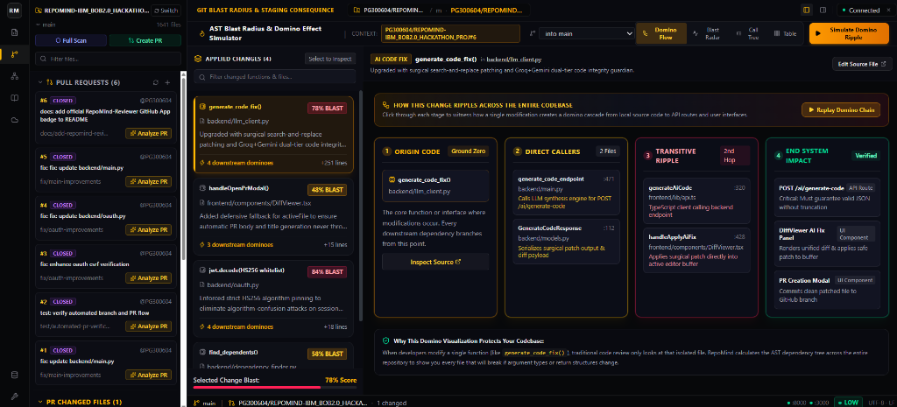

---

### Category 4: Developer Workspace, Remediation & Security Audit

#### 10. Obsidian Tabbed Code Editor
Full-featured IDE editor showing syntax highlighting, line numbers, branch switcher, AI Assist, and direct GitHub PR creation buttons (`backend/llm_client.py`).
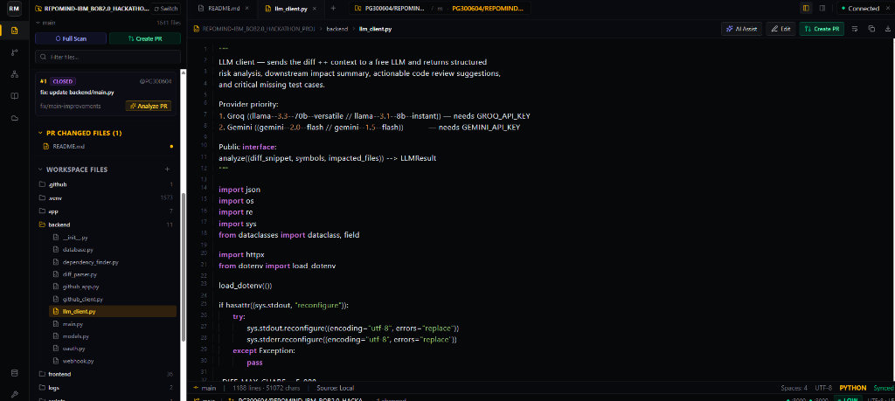

#### 11. AI Code Fix & Inline Unified Diff Preview
1-Click remediation engine displaying natural language prompt, AI patch rationale, side-by-side unified diff with syntax additions/deletions, and green **"Accept & Apply Fix"** button.
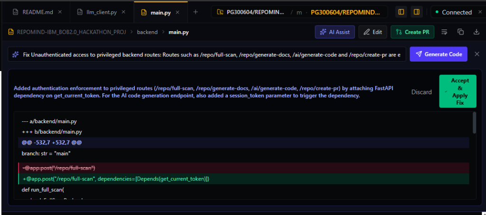

#### 12. Full Repository Security Audit (Scanning State)
Multi-model background scanner auditing authentication endpoints, AST dependencies, and UI schemas across the entire codebase.
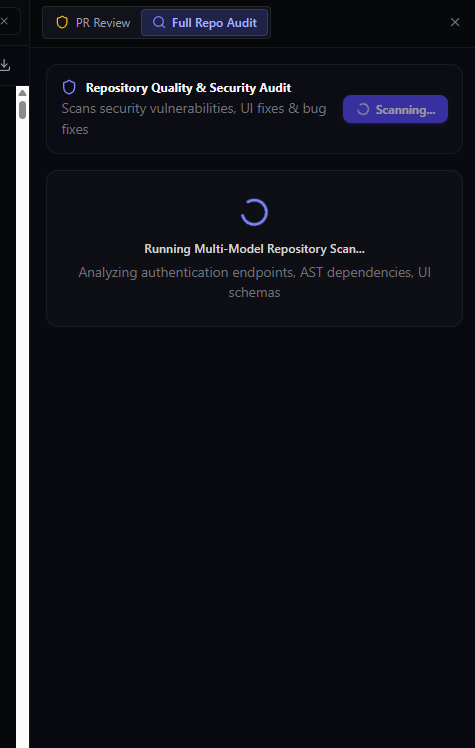

#### 13. Full Repository Security Audit Report & Health Index
Completed audit showing overall **Health Index (55/100)**, categorized tabs (Security, Bug, UI), critical vulnerability alerts, code remediation suggestions, and direct **"AI Write Fix"** triggers.
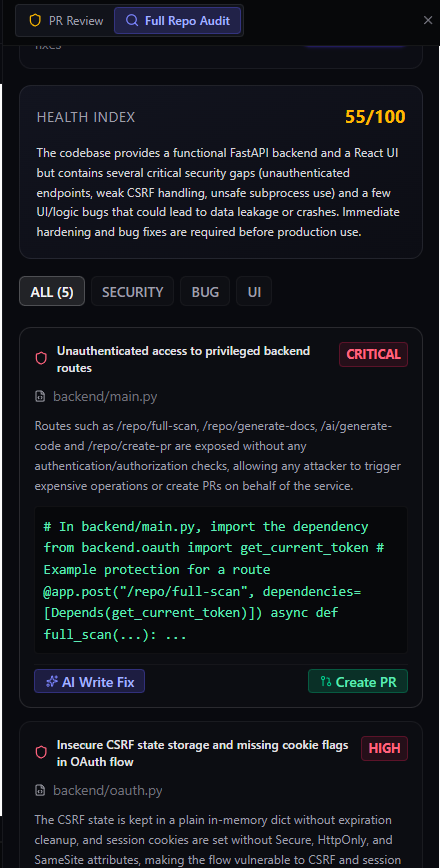

---

### Category 5: Living Architecture Blueprint, Telemetry & Model Ops

#### 14. Living AI Architecture Blueprint & Documentation Catalog
AI-generated 4-chapter repository user manual covering executive summary, core mission, architectural goals, and proprietary algorithms, with 1-click Markdown export.
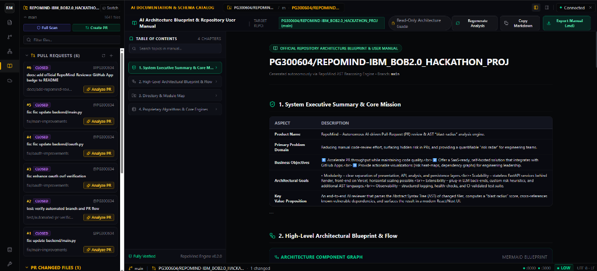

#### 15. SQLite Telemetry & 5-Stage System Flow
Telemetry dashboard displaying active database storage, cached PR analyses, active sessions, and the 5-stage pipeline (*Code Intake ➔ AST Engine ➔ Dual-Tier Fallback ➔ Integrity Guardian ➔ SQLite*), with 1-click DB vacuuming.
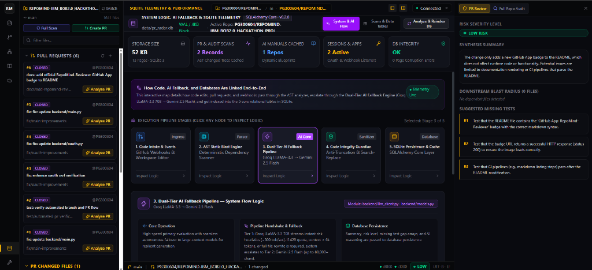

#### 16. Tools, Model Routing & Configuration Studio
Studio control center managing AI model routing (IBM watsonx.ai Granite 3.0, Groq LLaMA-3.3 70B, Google Gemini), 3-hop AST recursion depth, and step-by-step user guide.
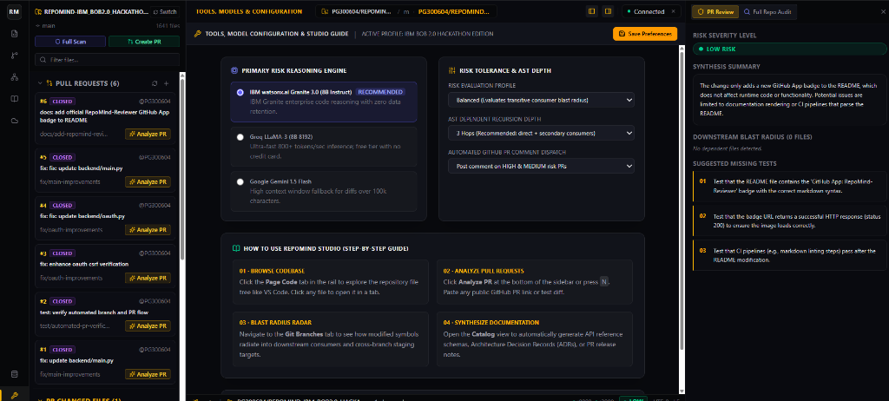

---

## Technical Innovation Summary

1. **AST Blast Radius Engine**: Eliminates blind merges by mapping multi-hop symbol dependencies across repositories.
2. **Dual-Tier Resilient AI Pipeline**: Groq LLaMA-3.3 70B primary engine (~250 tok/s) with silent fallback to Google Gemini 2.5 Flash ensures 100% review availability.
3. **Autonomous GitHub App (`repomind-reviewer[bot]`)**: End-to-end automation via RS256 JWT installation tokens and HMAC-SHA256 verified webhooks.
4. **1-Click Deep-Linked Remediation**: Seamless bridge from GitHub PR comments back into the Studio IDE with pre-loaded prompts and split diff previews.
5. **Code Integrity Guardian**: Strict anti-truncation and AST validability checks prevent incomplete code stubs or syntax errors from reaching production.

---

**RepoMind Release 2.0 (v2.0.0)**
Crafted with precision for the **IBM BOB 2.0 Hackathon 2026**

